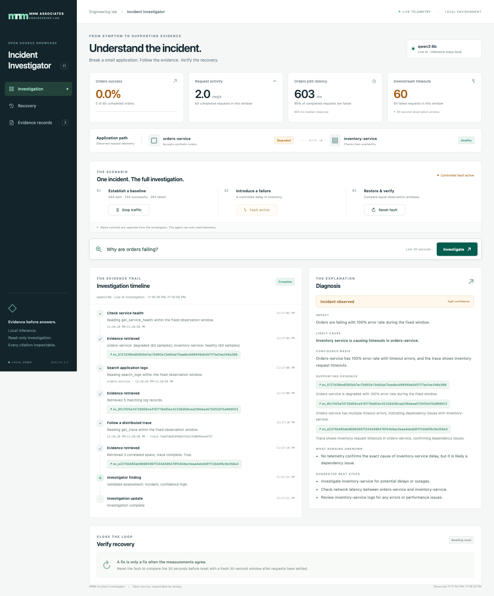

# MNM Incident Investigator

**Ask why orders are failing. Watch a local AI agent gather evidence. Check its explanation against the actual requests.**

Incident explanations are useful when an engineer can verify them. This open-source showcase runs two real Java services, introduces one controlled failure, and gives a local model five read-only telemetry tools. The model chooses its queries and writes an assessment with resolvable evidence links, qualitative confidence, and explicit uncertainty.



This is the working browser interface with real application traffic and a live local-model assessment. Numbers and wording in your run will differ. See the [healthy baseline](docs/screenshots/healthy.png), [measured recovery](docs/screenshots/recovery.png), and [three-minute demo script](docs/demo-script.md), then inspect the [recorded verification](docs/verification.md).

## Try the demo

From this project directory, with Docker Engine and Docker Compose v2 available:

```sh
make up
```

Open **http://127.0.0.1:8080**. Setup creates local control and ingestion tokens in the ignored `.env` file. The first build downloads container images and Java/Python dependencies; no cloud account, paid service, or API credential is required. A host Python 3 interpreter and `make` are needed for setup. Allow several minutes for the initial build; subsequent starts reuse caches.

Install and download the local model separately using [model setup](docs/model-setup.md). The default is Ollama with **`qwen3:8b`**. Application controls and telemetry work while the model is unavailable; the UI clearly disables live investigation until it is ready.

1. Click **Start traffic** and allow at least 33 seconds for a populated healthy observation window. Requests arrive at a target of two per second.
2. Optionally investigate the healthy baseline using the same question. The question alone must not establish a failure.
3. Click **Trigger fault**. Allow another 33 seconds. Orders now encounter an inventory response that exceeds their request timeout.
4. Ask **“Why are orders failing?”** and click **Investigate**. Follow tool calls, measured results, and concise findings in the timeline. Open the diagnosis citations to inspect their original query and returned records.
5. Keep traffic running, click **Reset fault**, and wait about 36 seconds. Compare two 30-second windows, including request volume, errors, timeouts, and latency.

Traffic stops automatically after 360 seconds. Restart it if a longer investigation leaves too few requests for recovery; collect a populated window before resetting again. Recovery is marked incomplete when sample counts or volumes are insufficient.

To erase this project's local telemetry and evidence and restart healthy:

```sh
make reset
```

To stop the stack while retaining evidence, run `make down`. Model downloads are managed by Ollama and survive either command. Changing `CONSOLE_PORT` in `.env` changes the Compose browser port.

## What the investigator can establish

`orders-service` calls `inventory-service` with a 600 ms request timeout. The operator's control introduces a 1,800 ms inventory delay. Java records actual request durations, HTTP results, JSON logs, and parent/child spans connected by W3C trace IDs.

Those configuration values describe the demo for the operator; they are not a scripted model answer. The investigator receives no fault state, control token, or scenario description. It must establish the observed downstream delay and orders timeout from telemetry. These observations alone cannot explain *why* inventory became slow. A useful assessment identifies that uncertainty and asks for the observation needed to resolve it.

Deterministic code retrieves records, calculates statistics, enforces budgets and permissions, and validates citations and basic evidence sufficiency. The model selects tools, tests hypotheses against results, and synthesizes the assessment. Invalid, missing, or insufficient evidence produces an incomplete result rather than a replacement incident story.

## Small, inspectable stack

- **Two Java 21 / Spring Boot services:** synthetic orders and inventory, actual HTTP requests, protected local fault control.
- **Python telemetry receiver and SQLite:** measured request observations, structured logs, and distributed spans using a small documented JSON protocol. This is custom instrumentation, not OTLP.
- **Read-only MCP service:** `get_service_health`, `get_service_map`, `query_metrics`, `search_logs`, and `get_trace`, with strict filters and persistent evidence snapshots.
- **Local investigation agent:** bounded Ollama tool-calling loop; no shell, write tools, or cloud inference fallback.
- **Browser console:** measured health and traffic, operator controls, investigation timeline, evidence viewer, and equivalent recovery windows. No frontend framework or external dashboard is required.

See the [architecture and trust boundaries](docs/architecture.md), [security notes](SECURITY.md), and [troubleshooting guide](docs/troubleshooting.md). This directory is an independent project and shares no runtime, source package, or deployment with the MNM Java Modernization Agent.

## Verify and develop

Install Python 3.12, [uv](https://docs.astral.sh/uv/getting-started/installation/), Java 21, and Maven 3.9 for development:

```sh
make test       # Python policy/telemetry/API tests and real Java service tests
make smoke      # Against the Compose stack: actual requests, fault, traces, recovery; no model
```

`uv.lock` fixes Python dependencies; the pinned Spring Boot parent manages Java dependencies. CI builds the services and runs deterministic tests and the real-stack smoke check without downloading a model. See [CONTRIBUTING.md](CONTRIBUTING.md) for local workflows.

For a host-only development run, use `make native`; Ctrl-C stops all child services. It uses the same application code and `.runtime` for logs and local databases. Native mode lacks Compose network and filesystem isolation and binds its six service ports to loopback. It requires local Java, Maven, Python, and uv.

Deterministic tests use clearly named mock model adapters where appropriate. They prove controller behavior, not live model quality. The production UI always uses the real configured Ollama model. Live evaluation commands, retained reports, actual environment, and untested paths belong in [verification](docs/verification.md); model output and timings can vary.

With the stack, model, and a populated healthy window ready, run:

```sh
uv run --frozen python scripts/evaluate.py --expect healthy --output .runtime/live-healthy.json
```

Use `--expect incident` after collecting a fault window, and `--expect incomplete` after an empty window. This evaluator checks actual model output and citation checksums; its expected result is never sent to the model, and it does not change fault controls.

## License and scope

Original project code and documentation are licensed under [Apache-2.0](LICENSE). Dependencies retain their own licenses; the separately downloaded Qwen3 model is also Apache-2.0 under its upstream terms. See the [dependency compatibility review](docs/dependencies.md) and [NOTICE](NOTICE).

This is one local, synthetic scenario. Telemetry can be dropped when its receiver or bounded export queue is unavailable; there is no production authentication, alerting, high availability, or comprehensive host telemetry. Evidence links resolve while the local evidence store is retained. Model judgments require an engineer's review.
