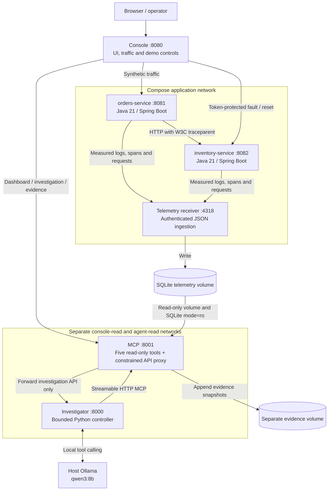

# Architecture and evidence

The demonstration contains one incident: a downstream response takes longer than its caller permits. Its three responsibilities are separate: the operator changes the demo, Java emits observations, and the agent investigates those observations.

The investigator does not join either the application network or the console network. MCP joins two separate read networks and forwards only explicit investigation API routes. The console never supplies control state to those routes. Investigator environment variables contain neither ingestion nor control tokens. The model receives only its policy, the question, fixed time bounds, five telemetry tool schemas, a local assessment submission schema, its prior messages, and retrieved results. It cannot read repository files or call arbitrary URLs.

## Real signals, deliberately small infrastructure

Java instrumentation measures elapsed time with a monotonic clock. Orders creates a server span and an inventory HTTP client span; inventory accepts the client's W3C `traceparent` and creates a child server span. Application logs contain the same trace and span IDs. Console logs use Spring Boot ECS JSON. Every completed application server request produces one metric observation; client spans do not inflate request counts.

The exporter submits batches to authenticated `POST /v1/events`. This is a project-specific JSON schema, **not OTLP**, and the receiver is not an OpenTelemetry Collector. The schema is documented in [CONTRACT.md](../CONTRACT.md). Direct instrumentation and a single SQLite store keep the demo runnable without a separate metrics database, log index, tracing backend, or visualization server. Supporting production collectors would require an adapter and additional operational design.

Only synthetic `/api/orders` and `/api/inventory` observations are accepted. Request headers, bodies, query strings, liveness probes, and fault-control endpoints are not exported. The receiver rejects extra fields and control-related records, validates IDs and timestamps, and redacts bounded strings before storage. A 2,000-event export queue, 100-event batches, and 1.5-second export timeout bound overhead. Failed batches and excess queued events can be lost; there is no replay. Inspect local service warnings if observed traffic and completed telemetry disagree.

Telemetry retention is 24 hours and at most 100,000 events, trimmed on ingestion. No-sample queries explicitly report unavailable data; absence of records does not establish success. Dashboard health describes observed requests, whereas `/actuator/health` describes process liveness. Inventory can return HTTP 200 after orders has already timed out; its error-free health badge does not imply acceptable latency.

## Deterministic tools

All MCP queries require explicit UTC start/end timestamps and at most a 15-minute window. Investigations normally use the last completed 30-second window, ending three seconds behind the present for export grace. The controller freezes those bounds for every call in that investigation. HTTP investigation requests accept windows from 10 to 300 seconds.

| Tool | Scope | Returned evidence |
| --- | --- | --- |
| `get_service_health` | Optional service; fixed time window | Completed counts, errors, rates, p95, last seen, observed health |
| `get_service_map` | Fixed time window | Edges inferred from observed service spans |
| `query_metrics` | Required service and time window | Request/error/timeout counts, request rate, nearest-rank p50/p95 |
| `search_logs` | Required service and time window; optional level/trace | At most 50 redacted records, stable record IDs and truncation flag |
| `get_trace` | Exact trace ID and time window | Bounded correlated server/client spans and logs, completeness limitations |

SQLite reads use parameterized queries and read-only connections. Queries are bounded to 10,000 rows; exceeding the statistics bound reports unavailability rather than a silently partial aggregate. MCP calls have an eight-second deadline and responses are bounded to approximately 64 KB. Trace results have separate span/log limits; their `complete` indicator is a structural check, not proof that all possible instrumentation exists.

Every query result includes `available`, `limitations`, its canonical query, and an `ev_…` ID derived from a hash of query plus result. Underlying records have content-derived `rec_…` IDs. Evidence snapshots live in a separate SQLite volume, survive telemetry retention, and resolve through the UI's `/api/evidence/{id}` endpoint. A reset that deletes volumes also deletes those snapshots. Jobs themselves are in memory and do not survive investigator restart.

## Model loop and validation

The model selects each query and receives deterministic results as untrusted tool data. Public updates are short findings, not private chain-of-thought. Limits are eight model turns, 12 tool calls, about 96 KB accumulated context, 60 seconds per model request, and 240 seconds per investigation. `INVESTIGATION_TIMEOUT_SECONDS` configures the outer deadline; lowering it shortens the budget, but raising it does not extend the agent's internal 240-second cap. No diagnostic answer is embedded in the model adapter.

The model also receives `submit_assessment`, a local structured completion function. It validates the diagnosis, citation membership, and evidence sufficiency, performs no I/O, and is never forwarded to MCP. It counts against the investigation budget; the last model turn is reserved for synthesis.

Before any telemetry result has been retrieved, the controller advertises only the telemetry tools and asks the model to choose one. A real response, including an unavailable-data result, enables assessment submission. The reserved final turn can still report incomplete without evidence. Nested assessment schema references are expanded for the model, while the original strict schema remains the runtime validator. Validation feedback identifies invalid fields without echoing their contents; provider-reported output truncation is shown explicitly in the timeline.

Code validates tool names, argument schemas, fixed windows, response size, and provenance. A complete assessment needs cited request samples from both services. A healthy conclusion cannot coexist with observed errors. An incident conclusion needs failed orders plus retrieved error logs and a trace whose failed orders client span is correlated with its downstream child. Every cited ID must have been retrieved during that run. Invalid conclusions receive a bounded correction opportunity; unresolved validation or exhausted budgets produce an explicitly incomplete assessment.

These checks establish basic support and citation identity. They do not prove that every natural-language interpretation is correct. The model must describe confidence qualitatively, separate observed mechanism from underlying cause, and identify an observation that would resolve uncertainty. Engineers can inspect the evidence instead of trusting the summary.

## Operator controls and recovery

The console schedules two synthetic requests per second for at most 360 seconds and at most eight requests concurrently. Only the console has the inventory control token. Browser control posts additionally require an explicit header and a same-origin check when an Origin is supplied. Compose publishes only the console, on loopback.

Reset captures a completed 30-second pre-reset window, clears the delay, waits three seconds for existing requests, measures another 30 seconds, and allows three more seconds for exports. It preserves the traffic worker's existing state; keep traffic running. Both services need at least 10 requests in each window and recovered volume between 70% and 130% of previous volume. Otherwise recovery is explicitly insufficient. With adequate samples the UI reports the measured errors, including remaining errors, rather than assuming reset succeeded.

Host-only `make native` is a development convenience. It filters child environments and uses the same tool restrictions, but process networks and local files are not isolated by a container boundary. Compose is the intended topology for demonstrating those boundaries.
